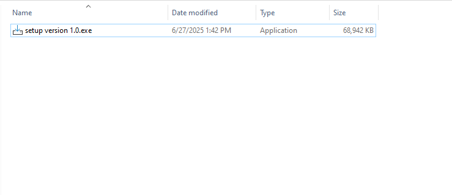
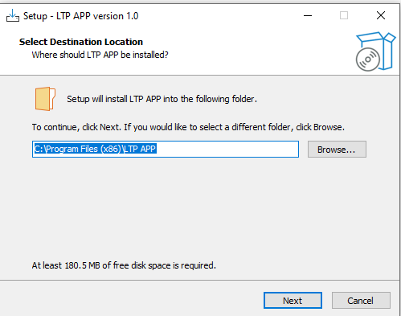
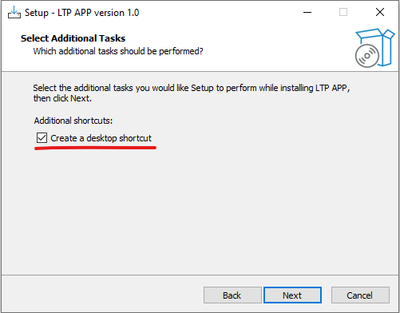
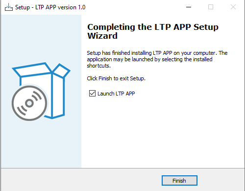
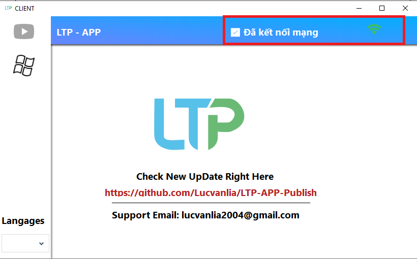
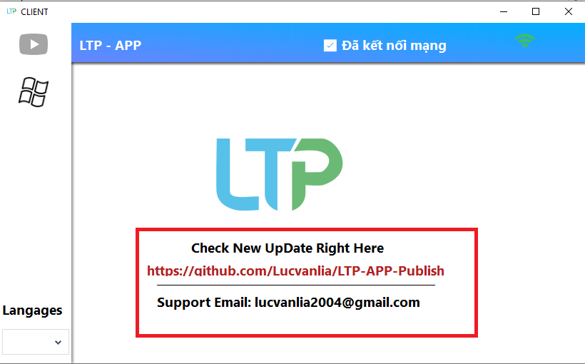
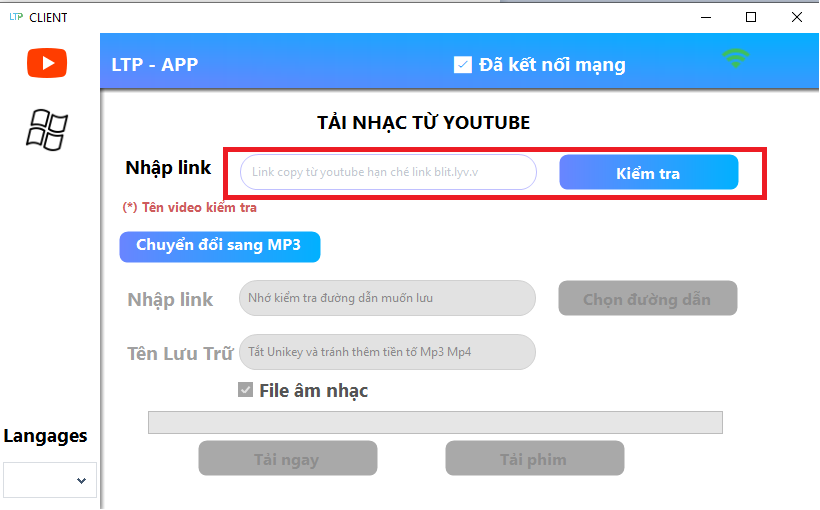
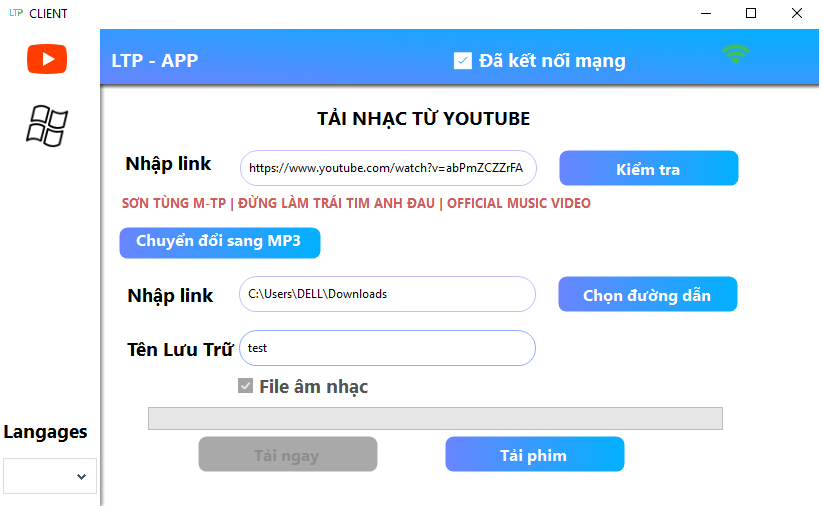
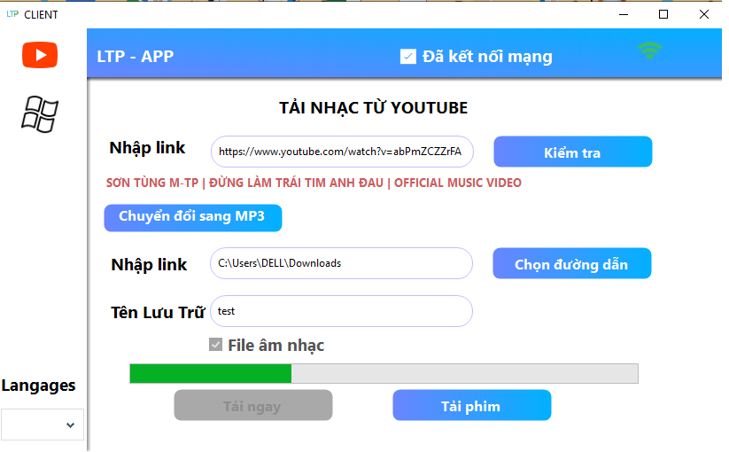

  

# 🎬 LTP App – YouTube Downloader  

© 2025 by IT FOR FREE

Phần mềm sử dụng các công cụ mã nguồn mở:
- [`yt-dlp`](https://github.com/yt-dlp/yt-dlp) (MIT License) – công cụ chính để lấy link YouTube
- [`ffmpeg`](https://ffmpeg.org/) (LGPL/GPL) – xử lý ghép và chuyển đổi định dạng

🚫 Cấm:
- Không được sử dụng vào mục đích thương mại dưới mọi hình thức./Not to be used for commercial purposes in any form.

✅ Cho phép:
- Dùng học tập, phi lợi nhuận/For education , non-profit

📫 Liên hệ tác giả: [lucvanlia2004@gmail.com]
## 🌐 Ngôn ngữ | Language

- 🇻🇳 Tiếng Việt (mặc định)
- 🇬🇧 English (coming soon…)

🎬 LTP App – YouTube Downloader
LTP App là một ứng dụng Windows nhẹ, giúp bạn tải nhanh video hoặc âm thanh từ YouTube chỉ với một cú nhấp chuột. Ứng dụng hỗ trợ hai định dạng tải:

🎵 M4A – Chỉ tải âm thanh (thích hợp nghe podcast, nhạc)
🎥 MP4 – Tải video đầy đủ (tự động ghép video/audio nếu cần)
🚀 Tính năng chính
✅ Tải video từ YouTube dưới định dạng:

M4A (âm thanh chất lượng cao)
MP4 (video chất lượng tốt nhất có thể)
✅ Tự động:

Phân tích định dạng tốt nhất
Ghép video và audio nếu YouTube tách riêng (DASH format)
✅ Giao diện đơn giản, dễ sử dụng
✅ Không quảng cáo, không cần trình duyệt

## 🛠️ Cài đặt | Installation

### Yêu cầu/Required:
- Windows 7/10/11 (x64)
- .NET Framework 4.7+
| Bước/Step | Ảnh minh họa/ Description Image |
|----------|---------------|
| Ấn để tải / Click here to Get Download || [])(#cai-dat--installation) |
| Click Here GetDowload |  |
| Path Save/Đường dẫn lưu |  |
| Tạo Lối tắt/ShortCut |  |
| Thành Công/Install Success |  |

## 🖼️ Hướng dẫn sử dụng nhanh | Quick Guide

| Màn hình | Ảnh minh họa |
|----------|---------------|
| Kiểm tran Mạng/Check Internet |  |
| Liên hệ/Contact|  |
| Chọn công cụ/Click Logo|  |
| Dán link/Paste Link|  |
| Thông tin lưu/Folder Save - Name File|  |
| Chọn tải nhạc hoặc Phim/Dowload music file or video file (chỉ 1/ only 1 one click )|  |
| Tải xong/Dowload sucess|  |
| Tải xong/Dowload sucess|  |

### Cai dat | Installation
Version 1.0
➡️ [Download bản mới nhất tại đây]([https://github.com/tenban/LTP-App/releases](https://github.com/Lucvanlia/LTP-APP-Publish/blob/main/Release/setup%20version%201.0.exe))

# 🖍️ Lỗi / Error
- Không thể mở video dạng VAC1 hoặc video không thể mở 2 cách sau / Can't play video pop up error VAC 2 option:
- Tải phần mềm đọc file/ dowload new app play video VLC media player [`vlc`](https://www.videolan.org/vlc/) 

